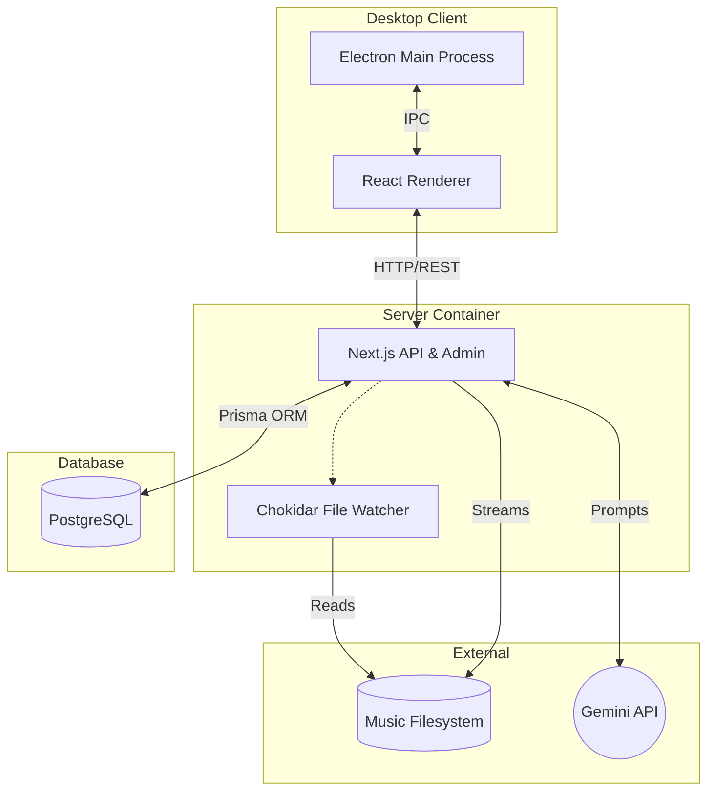

# Mugisk

Mugisk is a self-hosted, full-stack music streaming platform designed for personal use. It features an automated library scanner, a web-based Admin Panel, and a cross-platform Electron desktop client.

## Features & Roadmap Traceability

- **Phase 1 (Scaffolding):** Monorepo structure, database schemas (Prisma), Next.js backend, shared types.
- **Phase 2 (Auth):** Secure JWT with refresh-token rotation.
- **Phase 3 (Library Sync):** `chokidar`-based background service for automatic music folder scanning.
- **Phase 4 (Core API):** Audio streaming with HTTP Range requests, cover art extraction.
- **Phase 5 (Admin Panel):** Next.js Server Components-based web dashboard to manage the system.
- **Phase 6 (Desktop Shell):** Cross-platform Electron client with custom window controls and routing.
- **Phase 7 (Playlists & UI):** Drag-and-drop playlist management, persistent playback state.
- **Phase 8 (AI Features):** Generative AI integration (Gemini) for automatic playlist generation.
- **Phase 9 (Deployment):** Multi-stage Docker packaging, release builds, and comprehensive documentation.

## Architecture Overview



## Environment Variables Reference

| Variable | Required | Description |
|---|---|---|
| `POSTGRES_USER` | Yes | Database username (default: `mugisk`) |
| `POSTGRES_PASSWORD` | Yes | Database password |
| `POSTGRES_DB` | Yes | Database name (default: `mugisk`) |
| `DATABASE_URL` | Yes | Prisma connection string |
| `JWT_SECRET` | Yes | Secret for signing access tokens |
| `JWT_REFRESH_SECRET` | Yes | Secret for signing refresh tokens |
| `MUSIC_LIBRARY_PATH` | Yes | Host path to the music folder |
| `AI_API_KEY` | No | Google Gemini API key for AI playlists |

## Local Development Setup

1. **Install Dependencies:** `pnpm install`
2. **Start Database:** `docker compose up -d postgres`
3. **Migrate & Seed:** `pnpm --filter @mugisk/server run db:migrate:deploy && pnpm --filter @mugisk/server run db:seed`
4. **Run Server:** `pnpm --filter @mugisk/server run dev`
5. **Run Desktop App:** `pnpm --filter @mugisk/desktop run dev`

## Docker Production Setup

Run the entire stack easily using Docker Compose:

```bash
docker compose up -d --build
```

The Next.js server will be available on `http://localhost:3000`.

## API Endpoint Reference

| Method | Path | Auth Required | Description |
|---|---|---|---|
| `POST` | `/api/auth/login` | No | Authenticate user and receive tokens |
| `POST` | `/api/auth/refresh` | No (needs refresh token) | Obtain a new access token |
| `GET`  | `/api/tracks` | Yes | List all available tracks |
| `GET`  | `/api/tracks/:id/stream` | Yes | Stream audio file (supports HTTP Range) |
| `GET`  | `/api/tracks/:id/cover` | Yes | Retrieve extracted cover art |
| `GET`  | `/api/playlists` | Yes | List user's playlists |
| `POST` | `/api/playlists` | Yes | Create a new playlist |
| `POST` | `/api/playlists/generate`| Yes | Generate AI playlist (requires `AI_API_KEY`) |
| `POST` | `/api/admin/library/upload`| Yes (Admin) | Upload new tracks directly to the library |

---
*Developed for Phase 9 Defense.*
